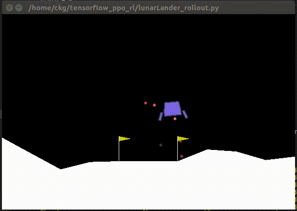
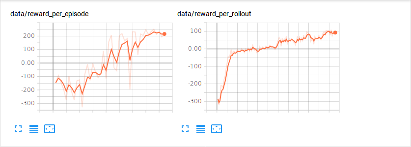
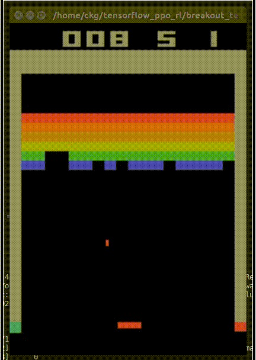

# This Repository is Reinforcement Learning related with PPO using Tensorflow

This Repository is Reinforcece Learning Implementation related with PPO.
The framework used in this Repository is Tensorflow. The multi-processing method is basically built in. The agents are trained by PAAC(Parallel Advantage Actor Critic) strategy.

## 1. LunarLander-v2  

###### LunarLander-v2

  
  

## 2. BreakoutDeterministic-v4

###### BreakoutDeterministic-v4

  
  

